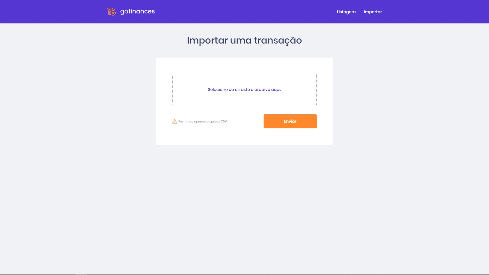

# Descrição

Esta é uma aplicação desenvolvida durante o curso GoStack da RocketSeat, e se trata do segundo desafio de ReactJS até o
momento.

Está é uma aplicação feita com typescript + ReactJS, além de estar conectada com uma api node escrita com typescript e
conectada a um banco postgress rodando em um docker.

A aplicação possui duas telas, e a navegação entre elas pode ser feita através de um menu no cabeçalho da página

-   ## Tela 1: Transações & Balanço

Nesta tela estão listadas todas as transações disponíveis no banco.

Traz as informações de titulo, preço, categoria e data na qual esta transação aconteceu.

Além disso traz um balanço geral destas transações, infomando o total em entradas, saídas e o valor final,
entradas - saídas.

-   ## Tela 2: Importar transações

Nesta tela podemos importar transações a partir de um arquivo csv para o banco da aplicação.

---

*A aplicação pode ser executada em ambiente de desenvolvimento executando: `yarn start`

**As informações de transações não serão exibidas se a aplicação não estiver conectada ao back-end, e este conectado a
um banco de dados.

# Desafio ReactJS 2

Segundo Desafio de ReactJS no curso GoStack.

## Objetivo

Essa será uma aplicação que irá se conectar ao seu backend do desafio FundamentosNode (https://github.com/DanielSLucas/fundamentosNode), e exibir as transações criadas e permitir a importação de um arquivo CSV para gerar novos registros no banco de dados.

## Funcionalidades da aplicação

  Com o template clonado e pronto para continuar, você deve verificar os arquivos da pasta src e completar onde não possui código, com o código para atingir os objetivos de cada rota.

-   [x] **`Listar os repositórios da sua API`**: Sua página `Dashboard` deve ser capaz de exibir uma listagem através de uma tabela, com o campo `title`, `value`, `type` e `category` de todas as transações que estão cadastradas na sua API.

**Dica**: Você pode utilizar a função [Intl](https://developer.mozilla.org/pt-BR/docs/Web/JavaScript/Reference/Global_Objects/NumberFormat) para formatar os valores. Dentro da pasta `utils` no template você encontrará um código para te ajudar.

-   [x] **`Exibir o balance da sua API`**: Sua página `Dashboard`, você deve exibir o balance que é retornado do seu backend, contendo o total geral, junto ao total de entradas e saídas.

-   [x] **`Importar arquivos CSV`**: Na sua página `Import`, você deve permitir o envio de um arquivo no formato `csv` para o seu backend, que irá fazer a importação das transações para o seu banco de dados. O arquivo csv deve seguir o seguinte [modelo](https://github.com/Rocketseat/bootcamp-gostack-desafios/blob/master/desafio-database-upload/assets/file.csv).

**Dica**: Deixamos disponível um componente chamado `Upload` na pasta `components` para você ter já preparado uma opção de drag-n-drop para o upload de arquivos. PS: Caso você esteja no windows e esteja sofrendo com algum erro ao tentar importar CSV, altere o tipo de arquivo dentro do arquivo `components/upload/index.ts` de `text/csv` para `application/vnd.ms-excel`.

**Dica 2**: Utilize o [FormData()](https://developer.mozilla.org/pt-BR/docs/Web/API/FormData/FormData) para conseguir enviar o seu arquivo para o seu backend.

## Testes

-   [x] **`should be able to list the total balance inside the cards`**: Para que esse teste passe, sua aplicação deve permitir que seja exibido na sua Dashboard, cards contendo o total de `income`, `outcome` e o total da subtração de `income - outcome` que são retornados pelo balance do seu backend.

-   [x] **`should be able to list the transactions`**: Para que esse teste passe, sua aplicação deve permitir que sejam listados dentro de uma tabela, toda as transações que são retornadas do seu backend.

**Dica**: Para a exibição dos valores na listagem de transações, as transações com tipo `income` devem exibir os valores no formado `R$ 5.500,00`. Transações do tipo `outcome` devem exibir os valores no formado `- R$ 5.500,00`.

-   [x] **`should be able to navigate to the import page`**: Para que esse teste passe, você deve permitir a troca de página através do Header, pelo botão que contém o nome `Importar`.

**Dica**: Utilize o componente `Link` que é exportado do `react-router-dom`, passando a propriedade `to` que leva para a página `/import`.

-   [x] **`should be able to upload a file`**: Para que esse teste passe, você deve permitir que um arquivo seja enviado através do componente de drag-n-drop na página de `import`, e que seja possível exibir o nome do arquivo enviado para o input.

**Dica**: Deixamos disponível um componente chamado `FileList` na pasta `components` para ajudar você a listar os arquivos que enviar pelo componente de `Upload`, ele deve exibir o título do arquivo e o tamanho dele.

---

*Este repositório teve como base um template disponibilizado pela equipe da rocketSeat.
